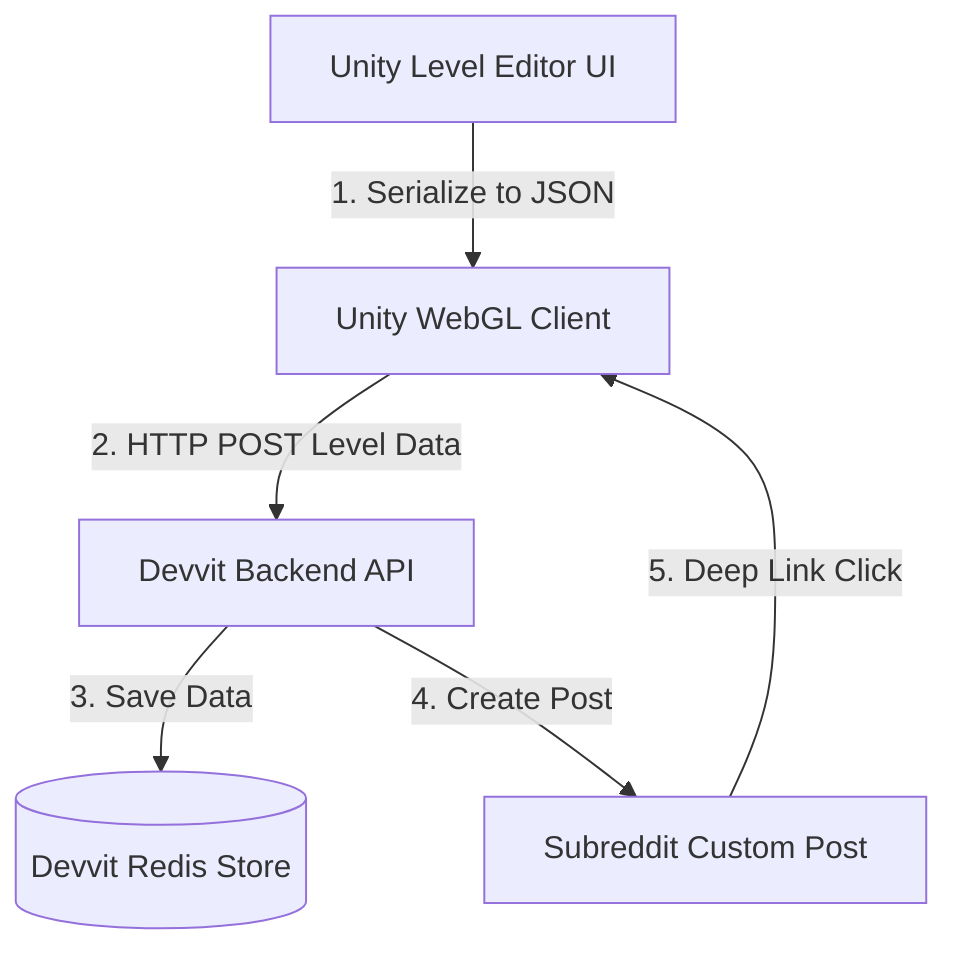

# Designing a Reddit Level Creator & Sharing System

This document outlines the technical architecture, data serialization, and backend integrations required to build a **User-Generated Level Editor & Sharing System** for *Hero of the North* running on Reddit via **Devvit**.

---

## 1. System Architecture Overview

The system consists of three main layers:



1. **Unity Level Editor (Frontend):** A grid-based tool inside Unity allowing players to paint blocks, drop hazards, place traps, and test playability.
2. **Devvit Backend (Middle-Tier):** Node.js/TypeScript endpoints built on Hono that authenticate creators, store levels, serve level lists, and handle ratings.
3. **Reddit Ecosystem (Social-Tier):** Automatically generating custom posts or comments in a subreddit for shared levels, allowing players to deep-link directly into the level.

---

## 2. Level Data Representation (Serialization)

To send levels over the network, Unity must convert the level layout into a lightweight JSON string.

### A. Level Schema Example (`LevelDataJSON`)
```json
{
  "levelName": "The Boulder Dash",
  "creator": "u/RedditUser",
  "gridWidth": 30,
  "gridHeight": 15,
  "playerPosition": { "x": -27.0, "y": 5.0 },
  "goalPosition": { "x": 15.0, "y": 2.0 },
  "blocks": [
    { "type": "Floor", "x": -27, "y": 4 },
    { "type": "PlatformGround", "x": -10, "y": 6 }
  ],
  "traps": [
    {
      "type": "ContinuousMotion",
      "spawnPos": { "x": -10, "y": 12 },
      "moveDir": "Down",
      "speed": 5.0,
      "delay": 0.5
    }
  ]
}
```

### B. Unity Implementation
Create a serializable scriptable schema in Unity:
```csharp
[System.Serializable]
public class LevelSaveData
{
    public string levelName;
    public string creator;
    public Vector2 playerPosition;
    public Vector2 goalPosition;
    public List<TileData> tiles = new List<TileData>();
    public List<TrapData> traps = new List<TrapData>();
}

[System.Serializable]
public class TileData
{
    public string type; // "Floor", "PlatformGround"
    public int x;
    public int y;
}

[System.Serializable]
public class TrapData
{
    public string type; // "SingleMotion", "RotationTrap", etc.
    public Vector2 spawnPos;
    public string moveDir;
    public float speed;
    public float delay;
}
```
*Use `JsonUtility.ToJson(levelSaveData)` to serialize and `JsonUtility.FromJson<LevelSaveData>(jsonString)` to deserialize.*

---

## 3. Unity In-Game Level Creator UI

A simple, responsive UI for editing levels on screen:

### Key Features
1. **Grid Snapping:** When objects are selected from the palette, snap their coordinates using:
   ```csharp
   Vector3 mouseWorldPos = Camera.main.ScreenToWorldPoint(Input.mousePosition);
   float snappedX = Mathf.Round(mouseWorldPos.x);
   float snappedY = Mathf.Round(mouseWorldPos.y);
   ```
2. **The Palette:** A scrollable panel containing placeable assets:
   * **Blocks:** Floor, Slippery Ice, Floating Platform.
   * **Hazards:** Spikes, Saws.
   * **Traps:** Pressure Plates, Falling Boulders (wired together).
   * **Essentials:** Player Start, Level Portal.
3. **Playtest Validation (The "Mario Maker" Rule):** 
   To prevent impossible levels from polluting the database, the creator **must beat the level** in playtest mode before the "Publish" button becomes active.

---

## 4. Devvit Backend API & Redis Database

Devvit provides a built-in **Redis Client** (`context.redis`) and a **Key-Value Store** (`context.kvStore`) which are perfect for storing and querying JSON-serialized level strings.

### A. API Endpoints (`src/server/routes/api.ts`)
Add three new routes to support custom levels:

1. **`POST /api/levels/publish`**
   * **Action:** Generates a unique Level ID (e.g. UUID). Saves level details to a Redis JSON entry (`level:{id}`). Adds the ID to a sorted list (`levels:all` or `levels:by_rating`).
   * **Reddit Integration:** Triggers Devvit's post creator to automatically publish a thread in your subreddit, sharing the level.
2. **`GET /api/levels/list`**
   * **Action:** Fetches the top/newest level metadata (ID, Creator, Title, Plays, Upvotes) using pagination.
3. **`GET /api/levels/load?id={levelId}`**
   * **Action:** Retrieves the full JSON payload of `level:{id}` to feed back into Unity.
4. **`POST /api/levels/rate`**
   * **Action:** Updates the upvote/downvote ratio on Redis.

### B. Redis Key Design
*   `level:{id}` (Hash or JSON): Stores `levelName`, `creator`, `playsCount`, `upvotes`, and the raw `levelJson` data.
*   `levels:newest` (Sorted Set): Score is the Unix timestamp of creation. Used to fetch new levels.
*   `levels:top` (Sorted Set): Score is the upvote count. Used to fetch popular levels.

---

## 5. Subreddit Integration & Deep-Linking

Sharing and playing custom levels natively inside Reddit is where Devvit shines.

### A. Deep-Linking via URL Parameters
When Devvit renders the game WebGL container, it can pass the **Reddit Post ID** or a **Query Parameter** (e.g., `?levelId=1234`) to the WebGL container via the `webView` config:

1. A Redditor clicks a shared post: `reddit.com/r/north_hero/comments/xyz/play_my_custom_level`.
2. The Devvit WebView launches and extracts `xyz` (the Post ID).
3. The Devvit WebView does an API call: `GET /api/levels/load?postId=xyz`.
4. Devvit sends the level JSON directly to Unity via a message:
   ```javascript
   unityInstance.SendMessage("LevelManager", "LoadCustomLevel", levelJson);
   ```
5. Unity boots directly into custom-play mode for that specific level!

### B. Social Feedback (Ratings & Comments)
*   **Auto-Post Thread:** The thread automatically created on Reddit acts as the level's comment section, allowing players to discuss strategies, leave feedback, and write reviews natively.
*   **Upvote Syncing:** Upvoting the Reddit post can automatically increment the level's score/rating in your database using Devvit's trigger events (`onPostUpvoted`).

---

## 6. Phase-by-Phase Implementation Plan

> [!TIP]
> Break the implementation into four small milestones to test systems independently.

*   **Phase 1: Local Editor & Testing (Unity Only):** Build the grid Snapping tool, block painting brush, and local JSON export/import tool.
*   **Phase 2: Redis Storage (Devvit Backend):** Implement the `publish` and `load` Hono endpoints to read/write JSON files to Devvit's Redis store.
*   **Phase 3: Level Browser (Unity Game Menu):** Add a scrollable "Redditor Levels" menu in Unity that fetches and displays the paginated list of shared levels.
*   **Phase 4: Reddit Deep-Linking (Devvit):** Set up post-launch handlers so loading a level's Reddit post directly launches that level in Unity.
